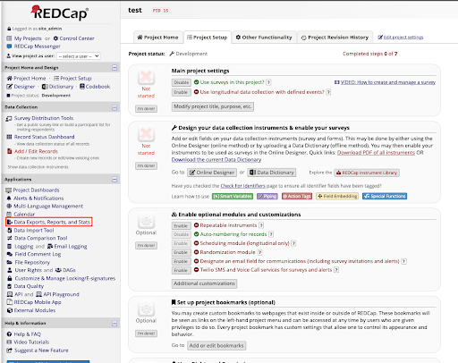
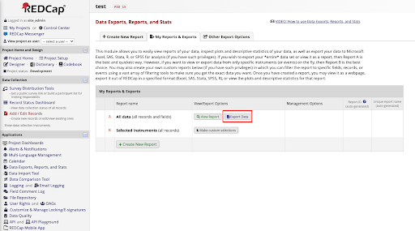
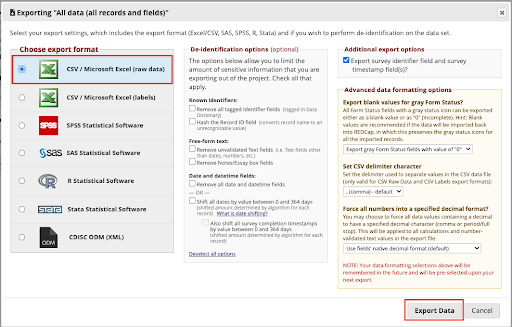
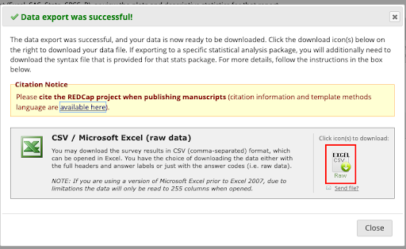
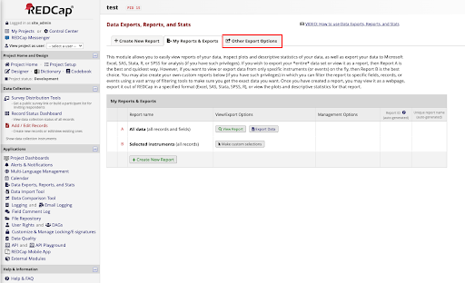
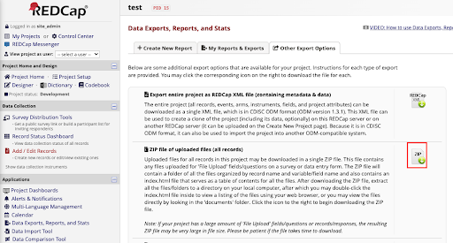
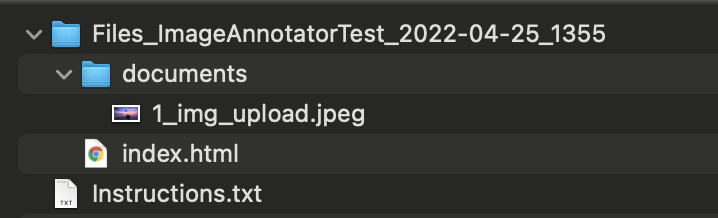

# Image Annotator

A REDCap external module (EM) that modifies the [Image Viewer EM](https://github.com/susom/redcap-em-image-viewer) to annotate uploaded images (using [markerjs2](https://markerjs.com/)) in notes box field types.

**NOTE**: This EM does not include the [Image Viewer EM's](https://github.com/susom/redcap-em-image-viewer) action tags.

## Instructions

1. Enable the Image Annotator EM through REDCap's control center
2. Create a new project and enable surveys in your project
3. Create a new instrument in the project designer with the following:
    - Add a field with using the **File Upload** field type, your variable name (e.g., `img_upload`), and `@IMAGE-ANNOTATE-UPLOAD` action tag
    - Add another field with the **Notes Box** field type, your variable name (e.g., `img_annotate`), and `@IMAGE-ANNOTATE` action tag assigned to your image upload variable name (e.g., `@IMAGE-ANNOTATE="img_upload"`)

## Supported File Types

- JPEG (.jpeg, .jpg, .jpe)
- PNG (.png)
- TIF (.tiff)
- GIF (.gif)

## Exporting Data

### Annotation Data
This module saves the annotation data within the note box field that will be available when exporting records as a CSV file. To export records:

1. Navigate to **Data Exports, Reports, and Stats**

2. Click **Export Data**, select **CSV/Microsoft Excel (raw data)** format, click **Export Data**, and 
then click on the **EXCEL CSV** icon to choose a destination to save the data

Each row will be a record and each column will be a data point collected, with the column name being the variable name for a field in the survey. The import columns to take note in the exported CSV are columns with the annotation data. On the backend, when a user creates and accepts an annotation, the annotation data is represented as a JSON object encoded as a string to be inserted into the Notes Box field type within REDCap. This allows the annotation data to be exported within the CSV file. More explicitly, the annotation data from [markerjs2](https://markerjs.com/) is strictly a [FreehandMarker](https://markerjs.com/reference/classes/freehandmarker.html) object which will have certain properties depending on the annotation created.

### Image Data

To export the images uploaded:

1. Navigate to **Data Exports, Reports, and Stats**

2. Click the **Other Export Options** tab and click the **ZIP** icon for **ZIP file of uploaded files (all records)** to choose a destination to save the data

3. When unzipped, it will contain the uploaded images with file naming scheme of `{record_ID}_{field_variable_name}.jpeg` where `record_id` is the ID assigned to the record and the `field_variable_name` is the variable name for field it was uploaded to. For example, below is the export of a single image with the variable name `img_upload`:

## Demo Example

Data for this demo can be located at `demo_data`.

