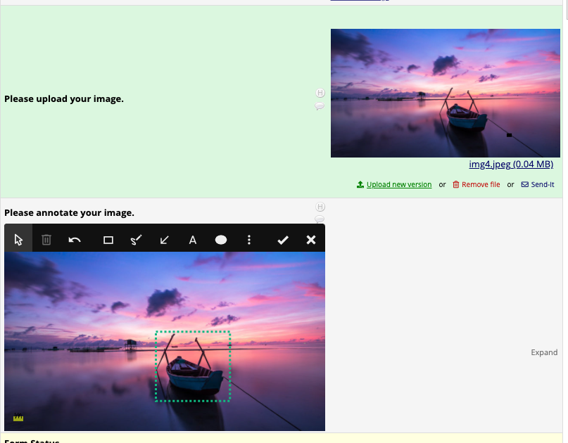

# Image Viewer and Annotate

A REDCap external module (EM) that extends the [Image Viewer EM](https://github.com/susom/redcap-em-image-viewer) to annotate uploaded images (using [markerjs2](https://markerjs.com/)) in notes box field types.

## Instructions

1. Enable the Image Viewer and Annotate EM through REDCap's control center
2. Create a new project and enable surveys in your project
3. Create a new instrument in the project designer with the following:
    - Add a field with using the **File Upload** field type, your variable name (e.g., `img_view`), and @IMAGEVIEW action tag
    - Add another filed with the **Notes Box** field type, your variable name (e.g., `img_annotate`), and @IMAGEANNOTATE action tag assigned to your image upload variable name (e.g., `@IMAGEANNOTATE="img_view"`)

## Supported Image Types

- JPEG (.jpeg, jpg, jpe)
- PNG (.png)
## Example

