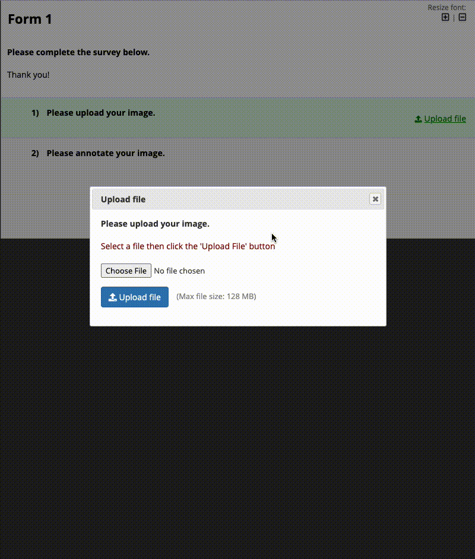

# Image Annotator

A REDCap external module (EM) that modifies the [Image Viewer EM](https://github.com/susom/redcap-em-image-viewer) to annotate uploaded images (using [markerjs2](https://markerjs.com/)) in notes box field types.

**NOTE**: This EM does not include the [Image Viewer EM's](https://github.com/susom/redcap-em-image-viewer) action tags.

## Instructions

1. Enable the Image Annotator EM through REDCap's control center
2. Create a new project and enable surveys in your project
3. Create a new instrument in the project designer with the following:
    - Add a field with using the **File Upload** field type, your variable name (e.g., `img_upload`), and `@IMAGE-ANNOTATE-UPLOAD` action tag
    - Add another field with the **Notes Box** field type, your variable name (e.g., `img_annotate`), and `@IMAGE-ANNOTATE` action tag assigned to your image upload variable name (e.g., `@IMAGE-ANNOTATE="img_upload"`)

## Supported File Types

- JPEG (.jpeg, .jpg, .jpe)
- PNG (.png)
- TIF (.tiff)
- GIF (.gif)
## Example

